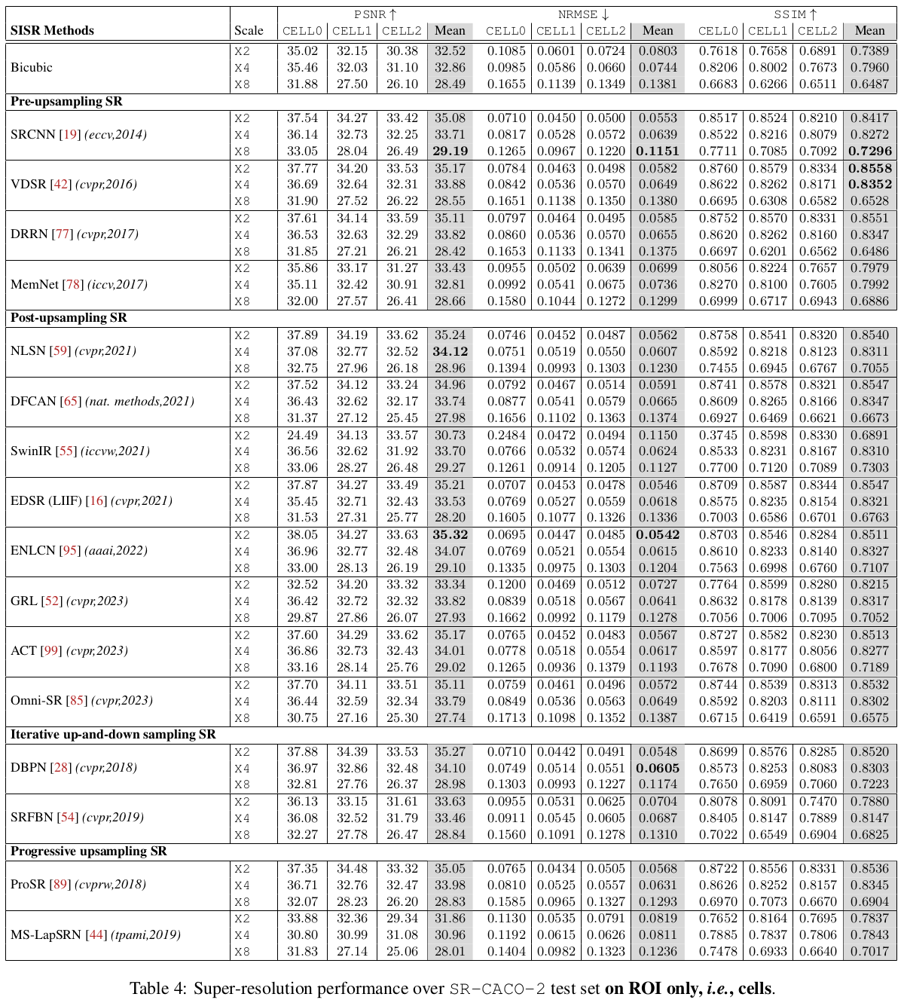
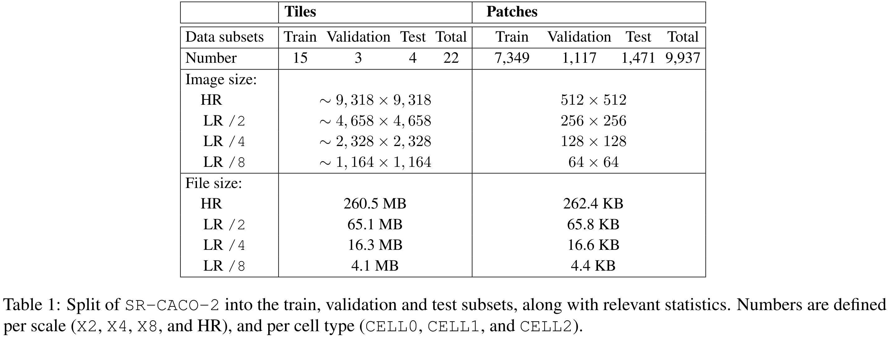
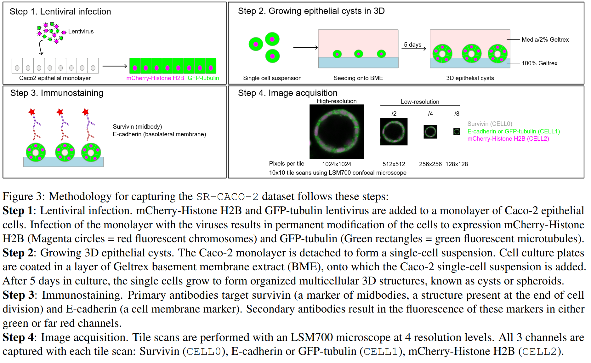

# [SR-CACO-2: A Dataset for Confocal Fluorescence Microscopy Image Super-Resolution](https://arxiv.org/pdf/2406.09168.pdf)


by **Soufiane Belharbi<sup>1</sup>, Mara KM Whitford<sup>2,3</sup>,
Phuong Hoang<sup>2</sup>, Shakeeb Murtaza<sup>1</sup>, Luke McCaffrey<sup>2,
3,4</sup>, Eric Granger<sup>1</sup>**


<sup>1</sup>  LIVIA, Dept. of Systems Engineering, ETS Montreal, Canada
<br/>
<sup>2</sup>  Goodman Cancer Institute, McGill University, Montreal, Canada
<br/>
<sup>3</sup>  Dept. of Biochemistry, McGill University, Montreal, Canada
<br/>
<sup>4</sup>  Gerald Bronfman Dept. of Oncology, McGill University, Montreal,
Canada


[](https://arxiv.org/abs/2406.09168)
[](https://huggingface.co/sbelharbi/sr-caco-2)
[](https://zenodo.org/doi/10.5281/zenodo.11617172) [[v1.0.0]](https://github.com/sbelharbi/sr-caco-2/releases/tag/v1.0.0)


<p align="center"></p>


## Abstract
Confocal fluorescence microscopy is one of the most accessible and widely used
imaging techniques for the study of biological processes at the cellular and
subcellular levels. Scanning confocal microscopy allows the capture of
high-quality images from thick three-dimensional (3D) samples, yet suffers from
well-known limitations such as photobleaching and phototoxicity of specimens
caused by intense light exposure, which limits its use in some applications,
especially for living cells. Cellular damage can be alleviated by changing
imaging parameters to reduce light exposure, often at the expense of image
quality. Machine/deep learning methods for single-image super-resolution (SISR)
can be applied to restore image quality by upscaling lower-resolution (LR)
images to produce high-resolution images (HR). These SISR methods have been
successfully applied to photo-realistic images due partly to the abundance of
publicly available data. In contrast, the lack of publicly available data
partly limits their application and success in scanning confocal microscopy.
In this paper, we introduce a large scanning confocal microscopy dataset named
SR-CACO-2 that is comprised of low- and high-resolution image pairs marked for
three different fluorescent markers. It allows the evaluation of performance of
SISR methods on three different upscaling levels (X2, X4, X8). SR-CACO-2
contains the human epithelial cell line Caco-2 (ATCC HTB-37), and it is
composed of 22 tiles that have been translated in the form of 9,937 image
patches for experiments with SISR methods. Given the new SR-CACO-2 dataset,
we also provide benchmarking results for 15 state-of-the-art methods that are
representative of the main SISR families. Results show that these methods have
limited success in producing high-resolution textures, indicating that SR-CACO-2
represents a challenging problem. Our dataset, code and pretrained weights are
available: https://github.com/sbelharbi/sr-caco-2.

**Code: Pytorch 2.0.0**

## Citation:
```
@article{belharbi24-sr-caco-2,
  title={SR-CACO-2: A Dataset for Confocal Fluorescence Microscopy Image Super-Resolution},
  author={Belharbi, S. and Whitford, M.K.M. and Hoang, P. and Murtaza, S. and McCaffrey, L. and Granger, E.},
  journal={CoRR},
  volume={abs/2406.09168},
  year={2024}
}
```

## Content:
<!-- * [Overview](#overview) -->
* [How to request the SR-CACO-2 dataset?](#req-ds)
* [Install](#reqs)
* [Dataset path](#datasets)
* [Run code](#run)
* [Pretrained weights (evaluation)](#weights)
* [SR-CACO-2 presentation](#sr-caco-2)


## <a name='req-ds'> How to request the SR-CACO-2 dataset? </a>:
If you are an academic, (i.e., a person with a permanent position at a research
institute or university, e.g. a professor, but not a
Post-Doc or a PhD/PG/UG student), please:

i) fill in this [EULA](./doc/EULA.pdf);

ii) use your official academic email (as data cannot be released to personal emails);

iii) send an email to luke.mccaffrey@mcgill.ca with subject: SR-CACO-2 request by academic;

iv) include in the email the above signed EULA, the reason why you require access to the SR-CACO-2 database, and your official academic website

In the case of Post-Docs or Ph.D. students: your supervisor/advisor should
perform the above described steps.


## <a name='reqs'> Install</a>:

```bash
# Create a virtual env.
./create_env.sh NAME_OF_THE_VIRTUAL_ENV
```

## <a name="datasets"> Dataset path </a>:

Once you download the dataset, you need to adjust the paths in
[get_root_datasets()](dlib/utils/utils_config.py).

## <a name="run"> Run code </a>:

* E.g.: Train `SwinIR` method, `CELL2`, `X8`:
```shell
  #!/usr/bin/env bash

  # Activate your virtual env.

  # ==============================================================================
  cudaid=$1
  export CUDA_VISIBLE_DEVICES=$cudaid

  export OMP_NUM_THREADS=50
python main.py \
       --task super-resolution \
       --scale 8 \
       --method SWINIR \
       --net_type swinir \
       --train_dsets caco2_train_X_8_in_64_out_512_cell_CELL2 \
       --valid_dsets caco2_val_X_8_in_64_out_512_cell_CELL2 \
       --test_dsets caco2_test_X_8_in_64_out_512_cell_CELL2 \
       --n_channels 1 \
       --valid_n_samples 128 \
       --checkpoint_eval 0.9 \
       --checkpoint_save 0.9 \
       --test_epoch_freq 10000 \
       --use_interpolated_low False \
       --inter_low_th 7.0 \
       --inter_low_sigma 6.0 \
       --dist_backend gloo \
       --distributed False \
       --eval_bsize 1 \
       --cudaid $cudaid \
       --debug_subfolder SURVEY \
       --amp False \
       --sample_tr_patch roi \
       --h_size 128 \
       --train_n 1.0 \
       --sample_tr_patch_th_style fix_threshold \
       --sample_tr_patch_th 4.0 \
       --eval_over_roi_also True \
       --eval_over_roi_also_model_select True \
       --da_blur False \
       --da_dot_bin_noise False \
       --da_add_gaus_noise False \
       --G_optimizer_type sgd \
       --max_epochs 100 \
       --G_scheduler_type MyStepLR \
       --batch_size 8 \
       --G_scheduler_gamma 0.5 \
       --G_optimizer_wd 0.0 \
       --G_scheduler_step_size 30 \
       --G_optimizer_lr 0.01 \
       --w_sparsity False \
       --swinir_window_size 8 \
       --swinir_depths 6+6+6+6 \
       --swinir_embed_dim 180 \
       --swinir_num_heads 6+6+6+6 \
       --swinir_mlp_ratio 2 \
       --swinir_upsampler pixelshuffledirect \
       --ppiw False \
       --l1 False \
       --l2 True \
       --l2_use_residuals False \
       --l2_lambda 1.0 \
       --l2sum False \
       --l2sum_use_residuals False \
       --l2sum_lambda 1.0 \
       --ssim True \
       --ssim_lambda 5.0 \
       --ssim_window_s 19 \
       --charbonnier False \
       --boundpred False \
       --local_moments False \
       --img_grad False \
       --norm_img_grad False \
       --laplace False \
       --norm_laplace False \
       --loc_var False \
       --norm_loc_var False \
       --norm_loc_var_ksz 3 \
       --norm_loc_var_use_residuals False \
       --norm_loc_var_lambda 1.0 \
       --norm_loc_var_type 2 \
       --hist False \
       --kde False \
       --ce False \
       --elb_init_t 1.0 \
       --elb_max_t 10.0 \
       --elb_mulcoef 1.01 \
       --exp_id 01_14_2024_00_11_43_277115__2942919
```

## <a name="weights"> Pretrained weights (evaluation) </a>:
We provide the weights for all the models (135 models: 15 methods x 3 cells
x 3 scales). Weights can be found at [Hugging Face](https://huggingface.co/sbelharbi/sr-caco-2) in the file [shared-trained-models.tar.gz](https://huggingface.co/sbelharbi/sr-caco-2/resolve/main/shared-trained-models.tar.gz?download=true).
To run a single case, e.g. for `ACT` method, `CELL0`, `X2`:
```bash
python eval.py --cudaid 0 --exp_path $root/shared-trained-models/SURVEY_ABLATIONS/super-resolution/ACT/caco2_train_X_2_in_256_out_512_cell_CELL0/id_12_21_2023_07_59_15_641499__1617383-tsk_super-resolution-x_2-netG_ACT-sd_0-l2_yes-ssim_yes
```
To run all 135 cases:
```bash
./eval_all.sh 0
```

The provided weights can be used to reproduce the reported results in the
paper in the paper:
<p align="center"></p>
<p align="center"></p>


## <a name="sr-caco-2"> SR-CACO-2 presentation </a>:
The file [share-visualization-30-samples-test.zip](https://huggingface.co/sbelharbi/sr-caco-2/resolve/main/share-visualization-30-samples-test.zip?download=true) contains visual predictions on the test set.


<p align="center"></p>

<p align="center"></p>

<p align="center"></p>

<p align="center"></p>

<p align="center"></p>

<p align="center"></p>

<p align="center"></p>
